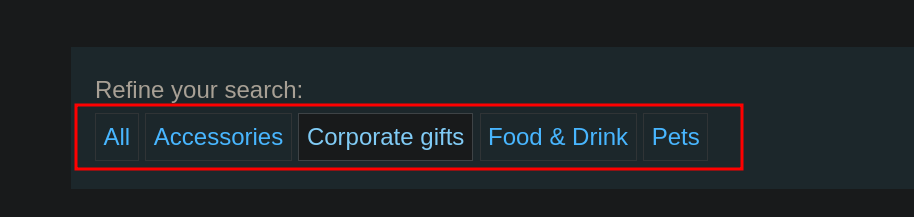
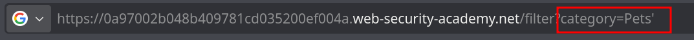
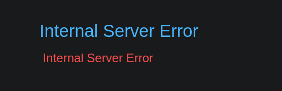
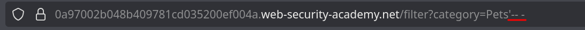
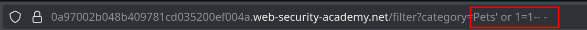

# Lab 1: SQL injection vulnerability in WHERE clause allowing retrieval of hidden data

## Statement

*This lab contains a SQL injection vulnerability in the product category filter. When the user selects a category, the application carries out a SQL query like the following:*

```sql
SELECT * FROM products WHERE category = 'Gifts' AND released = 1
```

*To solve the lab, perform a SQL injection attack that causes the application to display one or more unreleased products.*

## Walkthrough

Upon accessing the page, we see a shop with several products listed. There's a navigation bar to filter products by category.



When we filter by a category, the URL reflects the choice. We can test for a SQL injection vulnerability by adding a single quote (`'`) to the `category` parameter in the URL.



This action results in a 500 Internal Server Error, which suggests that our input has broken the SQL query.



The injected quote likely breaks the query like this:

```sql
SELECT * FROM products WHERE category = 'Pets'' AND released = 1
```

The extra quote makes the SQL syntax invalid, causing the database to return an error.

To confirm the vulnerability, we can try to fix the query by commenting out the rest of it. In many SQL dialects, we can use `-- -` for comments.



The page now loads correctly. The injected comment effectively neutralizes the rest of the original query, so the database executes a valid query.

Now that we can control the query, we can inject a condition that is always true, like `OR 1=1`.



This payload modifies the query to:

```sql
SELECT * FROM products WHERE category = 'Pets' OR 1=1-- -' AND released = 1
```

Because the `OR 1=1` condition makes the `WHERE` clause always true, the query will return all products, ignoring the original `AND released = 1` condition (which is commented out).

This reveals the unreleased products and solves the lab.

---
<div align="center">
  <a href="../README.md">⬅️ Previous Lab</a>
  &nbsp;&nbsp;&nbsp;&nbsp;&nbsp;
  <a href="../Lab-2/README.md">Next Lab ➡️</a>
</div>

