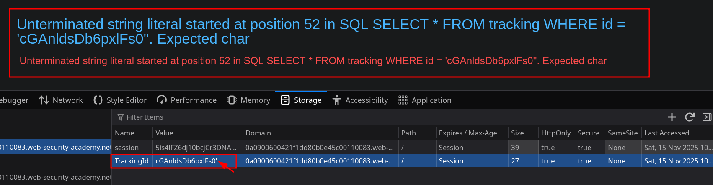
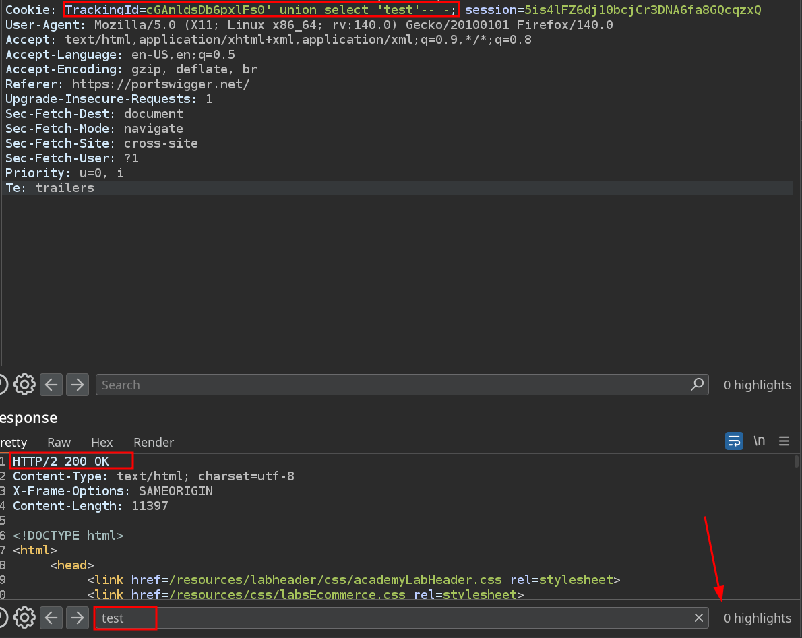
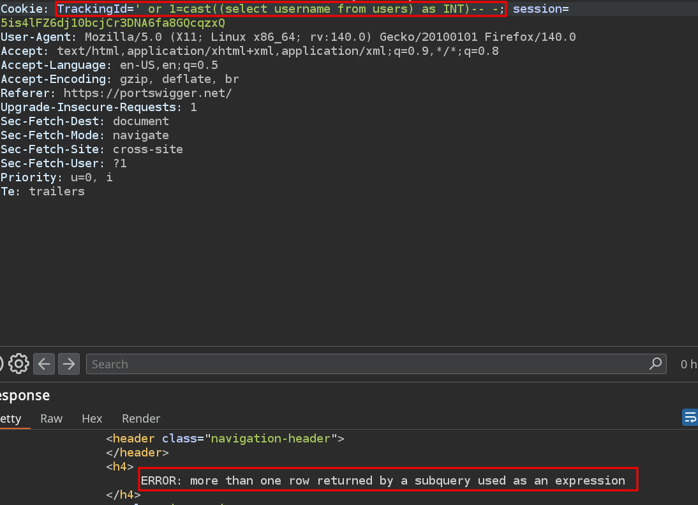
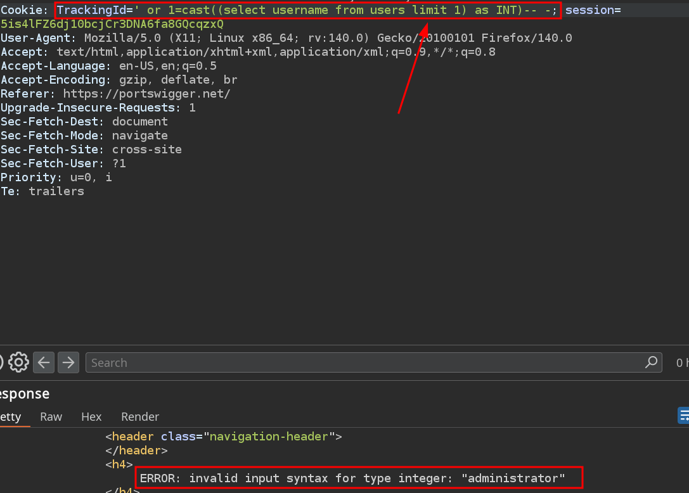
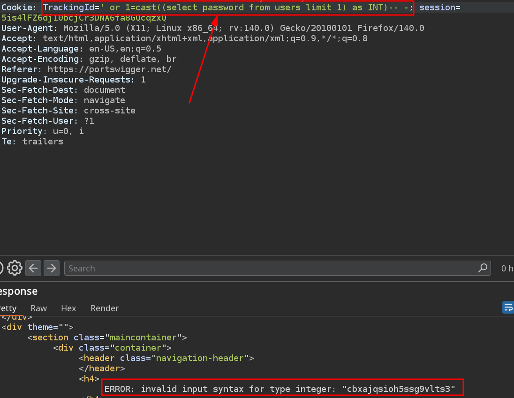

# Lab 13: Visible error-based SQL injection

## Statement

*This lab contains a SQL injection vulnerability. The application uses a tracking cookie for analytics, and performs a SQL query containing the value of the submitted cookie. The results of the SQL query are not returned.*

*The database contains a different table called `users`, with columns called `username` and `password`. To solve the lab, find a way to leak the password for the `administrator` user, then log in to their account.*

## Walkthrough

In this lab, the SQL injection is once again in the `TrackingId` cookie. The difference is that now the server reports errors on the screen. For example, if we put `'` we see the following:

We are going to intercept the request with Burp Suite and send it to the repeater to work with it. We discover with an `ORDER BY` that the query is returning 1 column and we try to perform a `UNION` attack. However, we see that the server does not show us the data we enter on the screen.

We could try to concatenate an `AND 1=1` or an `OR 1=1`, but in both cases the server responds with a 200 OK regardless of whether the equality is true or not, so we cannot use substrings to discover data.

What we must do is take advantage of the visible errors to obtain information. We can do this using `cast` to convert a value to `INT` and try to match it so that an error occurs. If we try to cast the `username` column of the `users` table we see the following error.

This indicates that we must use `limit` to select only one row.

The error that occurs shows us the value of the first row of the `username` column, which is `administrator`. We could try to do the same with the `password` column.

With this we get the error to give us the password, with which we can now log in as administrator and complete the lab.

---

  <a href="../Lab-12/README.md">⬅️ Previous Lab</a>
  &nbsp;&nbsp;&nbsp;&nbsp;&nbsp;
  <a href="../README.md">Next Lab ➡️</a>

