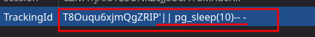

# Lab 14: Blind SQL injection with time delays

## Statement

*This lab contains a blind SQL injection vulnerability. The application uses a tracking cookie for analytics, and performs a SQL query containing the value of the submitted cookie.*

*The results of the SQL query are not returned, and the application does not respond any differently based on whether the query returns any rows or causes an error. However, since the query is executed synchronously, it is possible to trigger conditional time delays to infer information.*

*To solve the lab, exploit the SQL injection vulnerability to cause a 10 second delay.*

## Walkthrough

In this lab, the SQL injection is once again in the `TrackingId` cookie. The difference is that now we don't have to extract any information, we just have to inject a 10-second delay. To do this, we will try the syntax for each specific database. You can see them all here: [SQL injection cheat sheet](https://portswigger.net/web-security/sql-injection/cheat-sheet).

When we try with `'||pg_sleep(10)-- -` the delay occurs. This indicates that the database running behind the scenes is PostgreSQL and thus solves this lab.

---

  <a href="../Lab-13/README.md">⬅️ Previous Lab</a>
  &nbsp;&nbsp;&nbsp;&nbsp;&nbsp;
  <a href="../Lab-15/README.md">Next Lab ➡️</a>

