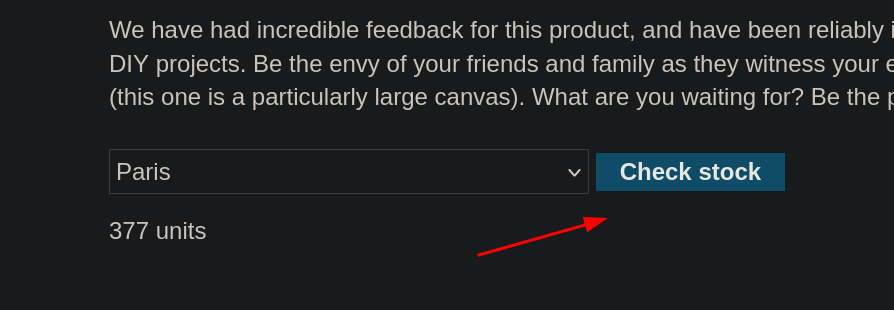
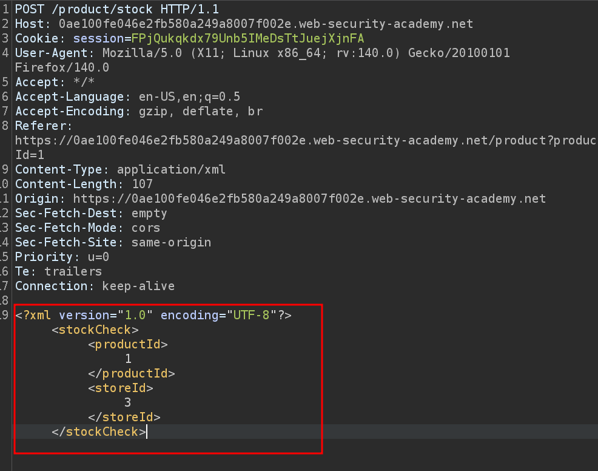
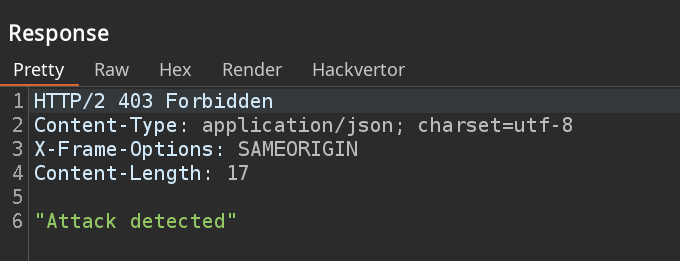
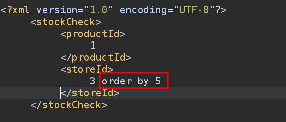
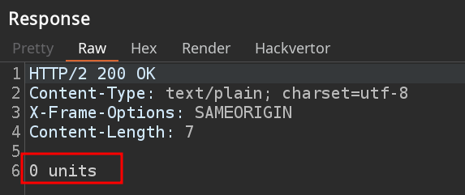
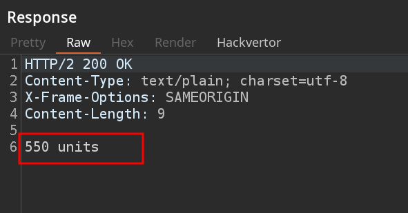
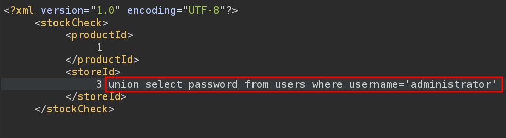
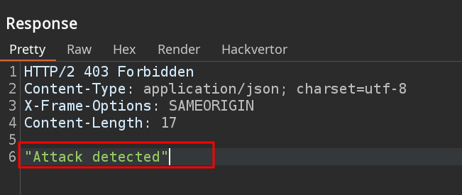
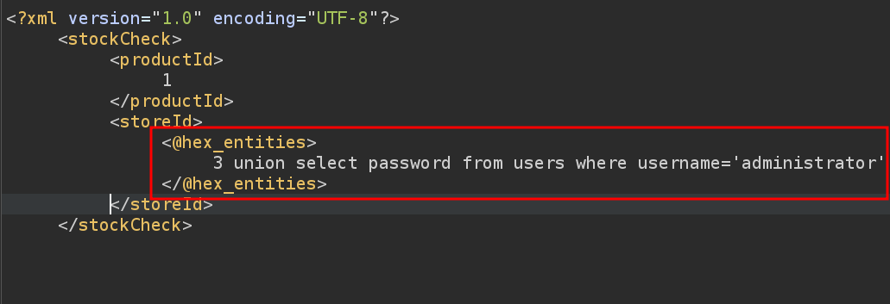
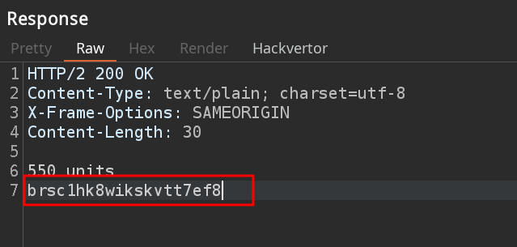

# Lab 18: SQL injection with filter bypass via XML encoding

## Statement

*This lab contains a SQL injection vulnerability in its stock check feature. The results from the query are returned in the application's response, so you can use a `UNION` attack to retrieve data from other tables.*

*The database contains a `users` table, which contains the usernames and passwords of registered users. To solve the lab, perform a SQL injection attack to retrieve the admin user's credentials, then log in to their account.*

## Walkthrough

In this lab, we are once again faced with the online store's web page. If we click on a product, we now see a section with a `Check stock` button that tells us how many units of that product there are depending on the location.

Let's pass this request through Burp Suite to see what is happening behind the scenes.

We observe that an `XML` is being processed. We can try to introduce quotes `'` in the `productId` fields, but the server responds with an `'Attack detected'`.

It seems that something is detecting that we are entering quotes `'` and it doesn't like it. We can try not to enter quotes, since `productId` is a numeric field, so it is not necessary to use them for the syntax to be correct. When we try an `ORDER BY`, we see that the server no longer detects the attack, but returns `0 units`.

As we decrease the number, the server returns a different response when we order by 1.

Now we could use a `UNION` attack to get the administrator's password, but it seems that it detects it as an attack again.

To get around this, we can install the BurpSuite extension `Hackvertor`, which we will use to encode our query in hexadecimal. We just have to select the query --> right click --> Extensions --> Hackvertor --> Encode --> hex_entities.

The request should look like this:

Now the server does not detect our attack, since we are sending the encoded data. However, the database is able to interpret this information, and returns the password in the response.

We now have the necessary credentials to log in as the `administrator` user and complete the lab.

---

  <a href="../Lab-17/README.md">⬅️ Previous Lab</a>
  &nbsp;&nbsp;&nbsp;&nbsp;&nbsp;
  <a href="../farewell.md">END ➡️</a>

