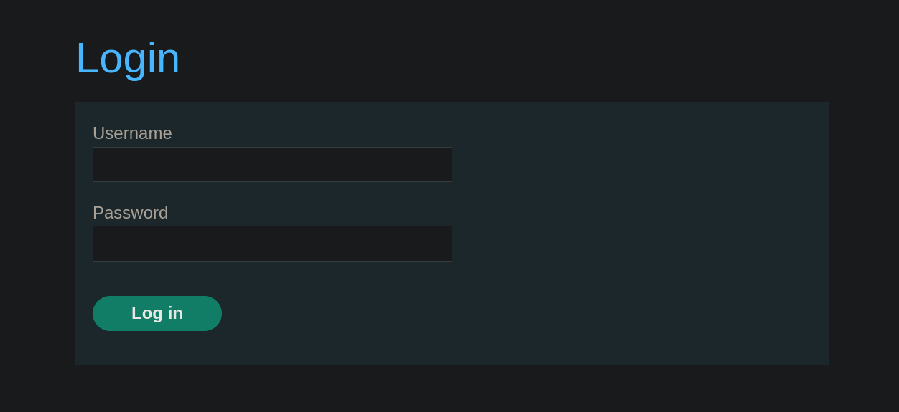
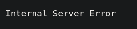
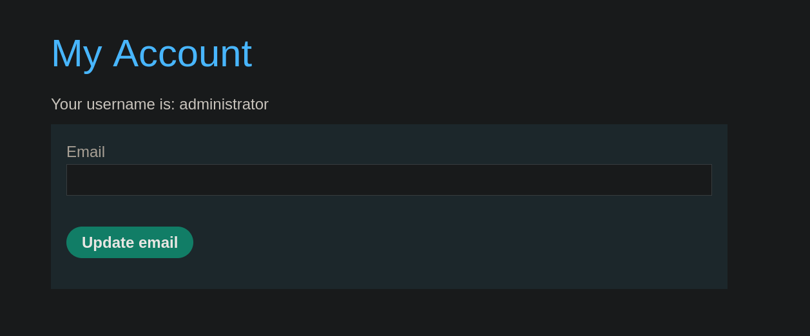

# Lab 2: SQL injection vulnerability allowing login bypass

## Statement

*This lab contains a SQL injection vulnerability in the login function.*

*To solve the lab, perform a SQL injection attack that logs in to the application as the `administrator` user.*

## Walkthrough

In this lab, we see that the website now has a "My account" section.


Accessing this section reveals an authentication panel. We can try to log in as the `administrator` user, but we don't have the password.



However, entering a single quote (`'`) in the password field results in a 500 Internal Server Error, indicating that we have corrupted the SQL syntax being evaluated on the backend.



At this point, we can assume that the query being used on the backend is something like this:

```sql
SELECT username FROM users WHERE password='EXAMPLE_PASS'
```

By using the same injection as in the previous lab, `' OR 1=1-- -`, the query would look like this:

```sql
SELECT username FROM users WHERE password='EXAMPLE_PASS' OR 1=1-- -
```

When we do this, the login panel will accept the password as valid, since the query evaluates to `True`, just like in the previous lab. We introduce the injection in the `password` field to complete the lab.



---
<div align="center">
  <a href="../Lab-1/README.md">⬅️ Previous Lab</a>
  &nbsp;&nbsp;&nbsp;&nbsp;&nbsp;
  <a href="../Lab-3/README.md">Next Lab ➡️</a>
</div>
