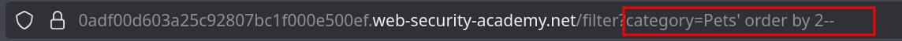
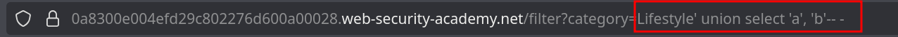
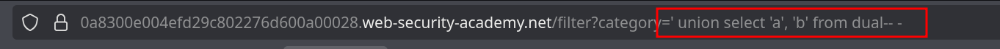
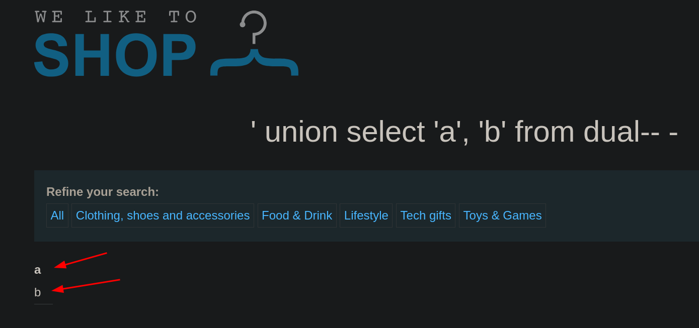
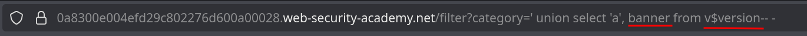
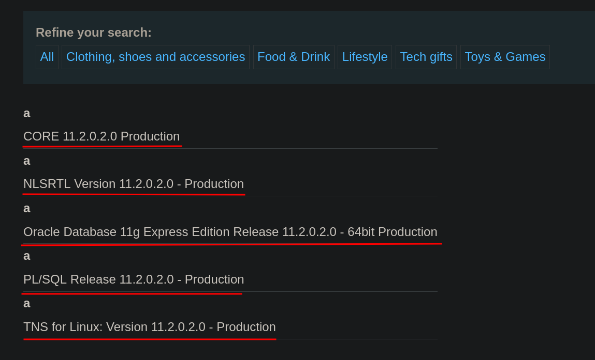

# Lab 3: SQL injection attack, querying the database type and version on Oracle

## Statement

*This lab contains a SQL injection vulnerability in the product category filter. You can use a `UNION` attack to retrieve the results from an injected query.*

*To solve the lab, display the database version string.*

## Walkthrough

### Recommendation

From now on, we will be dealing with different databases, each with its own particular syntax. If you are unfamiliar with the specific syntax of each database, it is advisable to have a cheatsheet on hand:

[SQLi cheatsheet](https://portswigger.net/web-security/sql-injection/cheat-sheet)
 
In this lab, we again encounter a product filter. Adding a single quote (`'`) to the URL gives us an Internal Server Error, indicating it is vulnerable to SQL injection. If we comment out the rest of the query with `-- -`, the website does not return an error.

In this case, we want to extract the database version. To do this, the first thing we need to find out is how many columns are returned by the application's query. We can use the `ORDER BY` syntax to do this. We'll increment the column number until the query fails, which tells us the number of columns in the original `SELECT` statement.

In this case, we see that `ORDER BY 3` causes an error, but `ORDER BY 2` does not, indicating that the query is returning 2 columns.



Once we know the number of columns, we can inject a `UNION` attack. We can use `NULL` as a placeholder for the columns.



However, we see that we get a server error. This is because this syntax is specific to databases like MySQL or PostgreSQL, but not Oracle. If we look at the cheatsheet, we see that in Oracle we must also specify a table in our `UNION SELECT` statement.

```sql
UNION SELECT 'x','y' FROM SOME_TABLE
```

Even if we don't know the table names, we can use the `dual` table, which is a special default table present in Oracle.



Now we see the data we have entered reflected on the web page.



As seen in the previous URL, it is advisable to remove the category and only use the single quote to hide the product data, which we are not interested in.

Now that we know how to display the data we are interested in on the web, we can see the database type and version by using the following Oracle-specific query.





---
<div align="center">
  <a href="../Lab-2/README.md">⬅️ Previous Lab</a>
  &nbsp;&nbsp;&nbsp;&nbsp;&nbsp;
  <a href="../Lab-4/README.md">Next Lab ➡️</a>
</div>