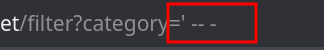
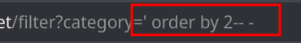
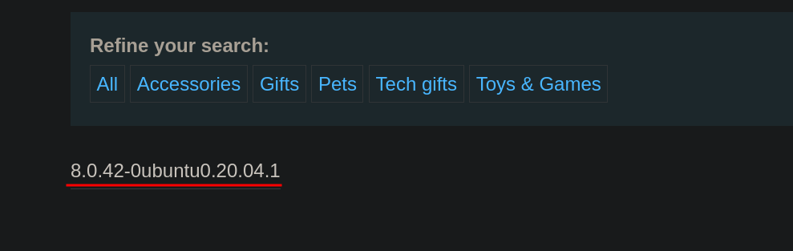

# Lab 4: SQL injection attack, querying the database type and version on MySQL and Microsoft

## Statement

*This lab contains a SQL injection vulnerability in the product category filter. You can use a `UNION` attack to retrieve the results from an injected query.*

*To solve the lab, display the database version string.*

## Walkthrough

This lab is very similar to the previous one; the only difference is the database being used. We will get straight to the point, so if you don't understand something, I recommend looking at the [previous lab's solution](../Lab-3/README.md).

As always, we confirm that it is susceptible to SQL injection by adding a single quote (`'`) and the comment (`-- -`).

Next, we use `ORDER BY` to discover the number of columns returned by the query. We see that the query returns 2 columns.

This is where the difference with the previous exercise lies. If we look at the [cheatsheet](https://portswigger.net/web-security/sql-injection/cheat-sheet), we see that to view the database version in MySQL and Microsoft, we do not need to specify a table as in Oracle. We only need to replace one of the columns in the `UNION SELECT` with the `@@version` variable. With this, we can list the requested data and complete the lab.

---

  <a href="../Lab-3/README.md">⬅️ Previous Lab</a>
  &nbsp;&nbsp;&nbsp;&nbsp;&nbsp;
  <a href="../Lab-5/README.md">Next Lab ➡️</a>

