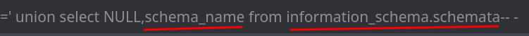
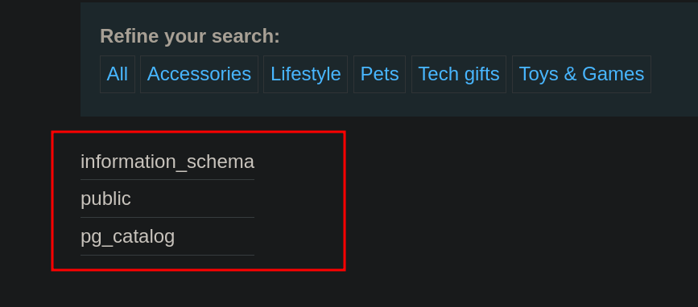
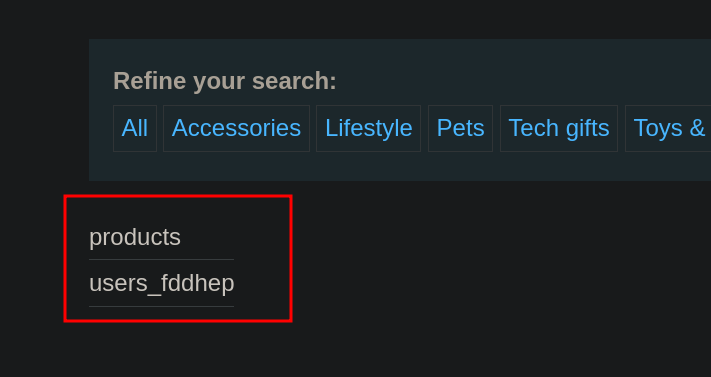
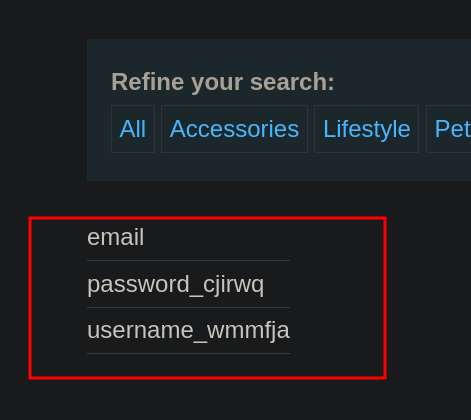
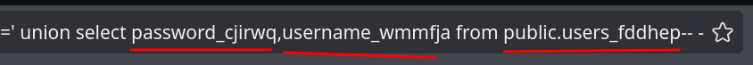

# Lab 5: SQL injection attack, listing the database contents on non-Oracle databases

## Statement

*This lab contains a SQL injection vulnerability in the product category filter. The results from the query are returned in the application's response so you can use a `UNION` attack to retrieve data from other tables.*

*The application has a login function, and the database contains a table that holds usernames and passwords. You need to determine the name of this table and the columns it contains, then retrieve the contents of the table to obtain the username and password of all users.*

*To solve the lab, log in as the `administrator` user.*

## Walkthrough

The beginning of this lab is the same as the previous ones. If you need a refresher, you can review it [here](../Lab-3/README.md).

We inject a quote, discover the number of columns returned by the query, and proceed with the `UNION` attack.

The statement tells us that we are not dealing with an Oracle database, so we don't need to worry about its specific syntax. The syntax we will use works for MySQL, PostgreSQL, and Microsoft.

First, we will list the names of the available databases from the `information_schema`. To do this, we can write the following:

```sql
UNION SELECT schema_name, NULL FROM information_schema.schemata
```



This is a special syntax that will show us all the database names.



Of the three names that appear, `information_schema` is a default schema, and `pg_catalog` is not of interest. We will focus on `public`.

Now that we know which one to list, we proceed to show the tables of the `public` schema. For this, we must modify our query:

```sql
UNION SELECT table_name, NULL FROM information_schema.tables WHERE table_schema='public'
```


Now we see the tables within `public`.



Of the tables that appear, we are interested in `users_...`, so we will proceed to list its columns using another variation of the syntax.

```sql
UNION SELECT column_name, NULL FROM information_schema.columns WHERE table_schema='public' AND table_name='users_fddhep'
```


Now we see the column names represented on the web.



Of the 3 columns, we are interested in `username_...` and `password_...`. Since we have two fields in our `UNION SELECT`, we can simply substitute those fields and tell the database where we are getting them from.



This shows us the data present in the columns, among which we find the password for `administrator`. With it, we can now log in and complete the lab.

---
<div align="center">
  <a href="../Lab-4/README.md">⬅️ Previous Lab</a>
  &nbsp;&nbsp;&nbsp;&nbsp;&nbsp;
  <a href="../Lab-6/README.md">Next Lab ➡️</a>
</div>
