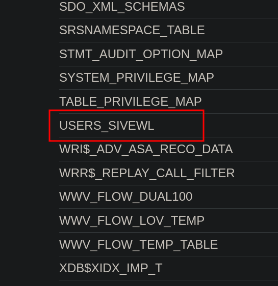
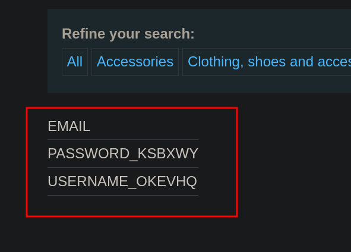
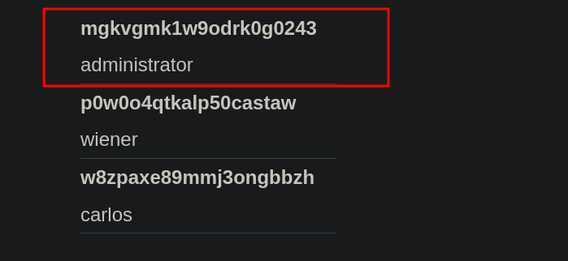

# Lab 6: SQL injection attack, listing the database contents on Oracle

## Statement

*This lab contains a SQL injection vulnerability in the product category filter. The results from the query are returned in the application's response so you can use a `UNION` attack to retrieve data from other tables.*

*The application has a login function, and the database contains a table that holds usernames and passwords. You need to determine the name of this table and the columns it contains, then retrieve the contents of the table to obtain the username and password of all users.*

*To solve the lab, log in as the `administrator` user.*

## Walkthrough

This lab is similar to the previous one, the difference being that we are now facing an Oracle database, so we will have to adjust the syntax.

We do the same as before: we introduce a single quote (`'`), comment out the rest of the query, and find out the number of columns returned by the original query by performing an `ORDER BY`.

However, when using `UNION SELECT` to inject and display our own data, we get an internal server error. This makes us wonder if we are dealing with an Oracle database.

To check this, we add a source table to our `UNION SELECT`. We will use `dual`, as we know it is a predefined table specific to Oracle.


We see that this way it does not give an error, which corroborates our theory.

Next, with the help of the [cheatsheet](https://portswigger.net/web-security/sql-injection/cheat-sheet), we proceed to list all tables using `all_tables`.

`UNION SELECT table_name, NULL FROM all_tables`


Of all the tables that appear, one catches our attention.



We will proceed to list the columns of the `USERS_...` table; for this, we will modify the query to use `all_tab_columns`.

```sql
UNION SELECT column_name FROM all_tab_columns WHERE table_name = 'USERS_...'
```




Of the available columns, we are interested in `USERNAME_...` and `PASSWORD_...`. Since we have two fields to enter data, we can simply indicate that we want to display those columns from the `USERS_...` table.




With this, we obtain the password for the `administrator` user, with which we can log in and complete the lab.

---
<div align="center">
  <a href="../Lab-5/README.md">⬅️ Previous Lab</a>
  &nbsp;&nbsp;&nbsp;&nbsp;&nbsp;
  <a href="../Lab-7/README.md">Next Lab ➡️</a>
</div>
