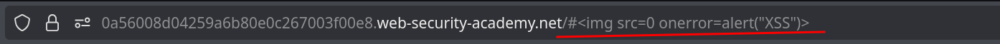
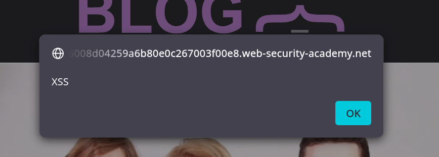
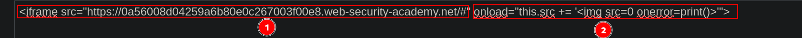

# Lab 6: DOM XSS in jQuery selector sink using a hashchange event

## Statement

*This lab contains a DOM-based cross-site scripting vulnerability on the home page. It uses jQuery's `$()` selector function to auto-scroll to a given post, whose title is passed via the `location.hash` property.*

*To solve the lab, deliver an exploit to the victim that calls the `print()` function in their browser.*

## Walkthrough

The first thing we notice upon entering the lab is the "Go to exploit server" button. This section will serve as our simulated attacker server to save and send our exploit to a victim.


If we press `Ctrl + U` to inspect the source code, we will see a section with the following JavaScript code:

```js
$(window).on('hashchange', function(){
    var post = $('section.blog-list h2:contains(' + decodeURIComponent(window.location.hash.slice(1)) + ')');
    if (post) post.get(0).scrollIntoView();
});
```

This code sets up an event listener that triggers whenever the URL's hash (the part after `#`) changes. When it changes, the script takes the hash value, decodes it, and uses it to find an `h2` element within the blog list that contains the hash text. If a matching post is found, the page scrolls to it.

The vulnerability occurs in the jQuery selector (`$()`). When HTML content is passed into the selector, jQuery temporarily creates that element. This means we can place our script in the URL hash, and it will be executed upon a hash change.





We are closer to solving the lab, but there's one small challenge left. If we send the link above to the victim, the XSS will not trigger because the page needs to reload with the instruction. It won't work if it's already in the URL when the page first loads.

To achieve this, we can use an `iframe` element, which allows us to embed another HTML page into the current one.

We can write the following in the `body` of our exploit server's response:

```html
<iframe src="https://YOUR-LAB-ID.web-security-academy.net/#" onload="this.src+=''"></iframe>
```



The `iframe` will first load the page with an empty hash. Once loaded, the `onload` event triggers, which appends our XSS payload to the `iframe`'s `src` URL. This causes the `hashchange` event to fire on the embedded page, executing our payload.

Now we just have to click "deliver exploit to victim" to complete the lab.

---
<div align="center">
  <a href="../Lab-5/README.md">⬅️ Previous Lab</a>
  &nbsp;&nbsp;&nbsp;&nbsp;&nbsp;
  <a href="../Lab-7/README.md">Next Lab ➡️</a>
</div>